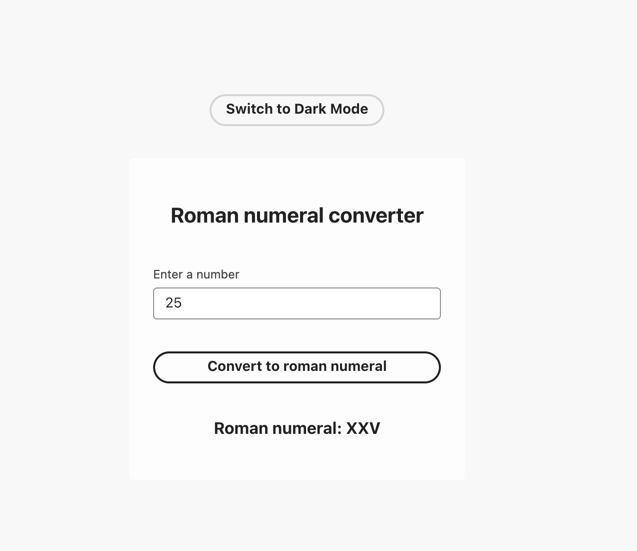
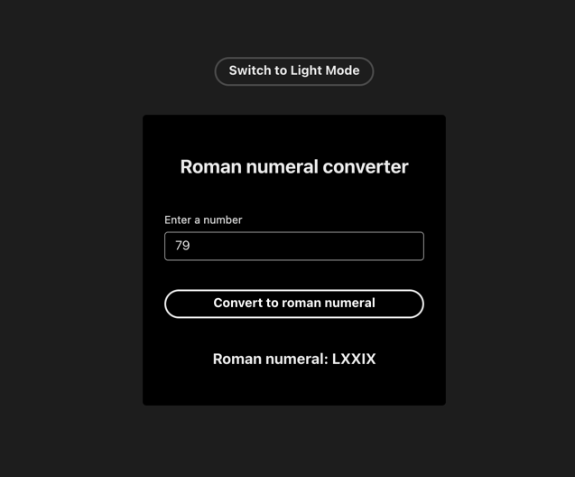

Roman Numeral Converter
=======================

A full-stack application that converts whole numbers (1--3999) into Roman numerals. It consists of a Spring Boot backend API exposing a `/romannumeral` REST endpoint and a React UI built with Adobe React Spectrum.
* * * * *

Table of Contents
-----------------

-   [Features](#features)

-   [Technologies](#technologies)

-   [Prerequisites](#prerequisites)

-   [Installation](#installation)

-   [Running Locally](#running-locally)

-   [Docker Setup](#docker-setup)

-   [Usage Examples](#usage-examples)

-   [Observability](#observability)

-   [Troubleshooting](#troubleshooting)


* * * * *

Features
--------

-   **REST API**: GET /romannumeral?query={integer} returns JSON:

    ```
    { "input": "{integer}", "output": "{roman}" }

    ```

-   **Validation**: Errors for non-numeric or out-of-range inputs (1--3999) return HTTP 400 with a plain-text message.

-   **React UI**: Built with Adobe React Spectrum, supports light/dark toggle and responsive design.

-   **Dockerized**: Single container serves both backend and frontend.

* * * * *
Modes
--------





* * * * *

Technologies
------------

| Layer | Technologies |
| --- | --- |
| **Backend** | Java 17, Spring Boot, Spring Web, Actuator, Micrometer (Prometheus), Sleuth (Zipkin) |
| **Frontend** | React 19, Create React App, Adobe React Spectrum |
| **Build & Deploy** | Maven, Node.js/npm, Docker multi-stage builds |

* * * * *

Prerequisites
-------------

-   Java 17 JDK or Docker

-   Maven Wrapper (`./mvnw`) or installed Maven

-   Node.js 18+ and npm (for local frontend builds)

-   Docker (for containerized run)

* * * * *

Installation
------------

1.  **Clone the repository**

    ```
    git clone https://github.com/sdwaraki/roman-numeral-service.git
    cd roman-numeral-service

    ```

2.  **Build the React UI**

    ```
    cd ui
    npm install
    npm run build
    cd ..

    ```

3.  **Copy UI into backend**

    ```
    mkdir -p src/main/resources/static
    cp -r ui/build/* src/main/resources/static/

    ```

4.  **Build the Spring Boot JAR**

    ```
    ./mvnw clean package

    ```

* * * * *

Running Locally
---------------

Start the backend (serves UI a `/` and API at `/romannumeral`):

```
./mvnw spring-boot:run

```

Open [http://localhost:8080](http://localhost:8080/) in your browser.

Alternatively, for frontend development with hot reload:

```
# Terminal 1
./mvnw spring-boot:run

# Terminal 2
cd ui
npm start

```

Navigate to [http://localhost:3000](http://localhost:3000/).

* * * * *

Docker Setup
------------

Build and run a single container:

```
docker build -t roman-numeral-service .
docker run --name roman-numeral-service --rm -p 8080:8080 roman-numeral-service &

```

Visit [http://localhost:8080](http://localhost:8080/).

To stop the container
```
docker stop roman-numeral-service

```

To view the logs
```
docker logs -f roman-numeral-service

```

A sample request log is as follows: It contains the timestamp, message, spanID and traceID
```json
{"@timestamp":"2025-07-31T02:59:30.33481051Z","@version":"1","message":"Received raw query=30","logger_name":"com.example.romannumeralservice.RomanNumeralController","thread_name":"http-nio-8080-exec-1","level":"DEBUG","level_value":10000,"traceId":"688adc12b9f583fe1f703019fb20771a","spanId":"1f703019fb20771a"}
```

* * * * *

Usage Examples
--------------

**Valid request**

```
curl "http://localhost:8080/romannumeral?query=1999"
# → {"input":"1999","output":"MCMXCIX"}

```

**Non-numeric input**

```
curl "http://localhost:8080/romannumeral?query=foo"
# → Query must be a whole number between 1 and 3999

```

**Out-of-range**

```
curl "http://localhost:8080/romannumeral?query=4000"
# → Query must be a whole number between 1 and 3999

```

* * * * *

Observability
-------------

-   **Logs**: JSON output via Logback + Logstash encoder (`logback-spring.xml`).

-   **Metrics**: Prometheus endpoint at `/actuator/prometheus` (requires Micrometer + Actuator).
     - Http server metrics : `http://localhost:8080/actuator/metrics/http.server.requests`
     - Health: `http://localhost:8080/actuator/health`

* * * * *

Troubleshooting
---------------

-   **UI build missing**: Ensure you run `npm run build` in `ui/` and copy into `static/` before packaging.

-   **Actuator endpoints not visible**: Check `application.properties` for:

    ```
    management.endpoints.web.exposure.include=*

    ```

-   **Prometheus metrics missing**: Confirm `micrometer-registry-prometheus` is on the classpath and you've invoked `/romannumeral` at least once.

-   **Forwarding not working**: Use a plain `@Controller` (not `@RestController`) for catch-all and return `forward:/index.html`.

* * * * *
